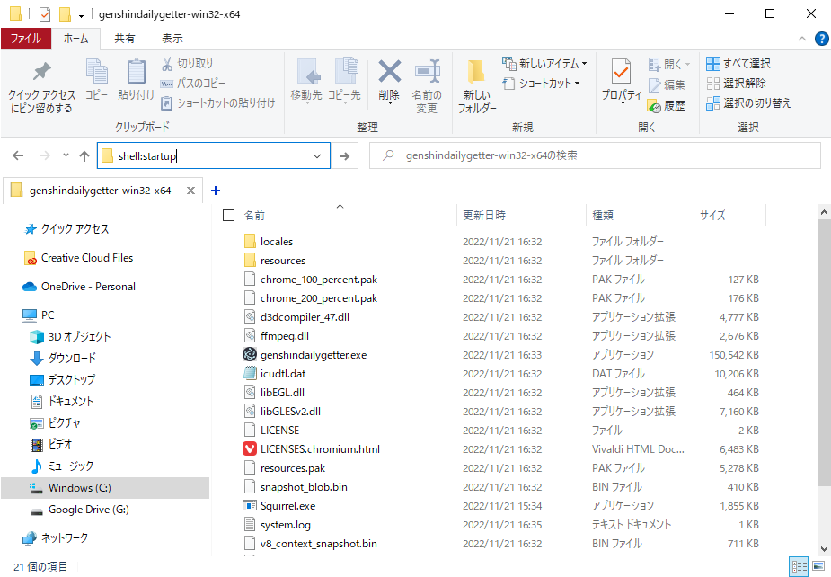

# Genshin Daily Getter

## 使い方

1. アプリをダウンロードする。 
   下のリンクからzipをダウンロードして解凍し、適当なフォルダに置いておく。 
   [genshinDailyGetter.zip](https://drive.google.com/file/d/1EG7RTzwfFw8spS5PTP5Bt1YYhG6Voubf/view?usp=share_link)
     
2. app.ini にユーザー情報を入力する。 
   [HoYoLAB](https://www.hoyolab.com/home)にアクセスし、ログインしておく。 
   HoYoLAB を開いたブラウザで **F12**、もしくは **Ctrl + Shift + i** を入力して開発者ツールを開く（デフォルトは英語表記）。 
   上のアプリケーションタブから Cookie -> `https://www.hoyolab.com` を開き、**ltuid** と **ltoken** の値をresources/app/app.iniファイルの **LTUID** と**LTOKEN** にそれぞれコピペする。  
     
3. 起動してみる。 
   genshindailygetter.exeを起動する。 
   既にデイリー報酬を受け取っていた場合、「今日のデイリー報酬は受け取り済みです。」という通知が届く。そうでない場合、「デイリー報酬を受け取りました。」というメッセージと、受け取った報酬の内容の通知が届く。  
4. PC起動時に受け取るようにする。 
   genshindailygetter.exeのショートカットを作成する。 
   エクスプローラーを開き、アドレスバーに「shell:startup」と入力すると、スタートアップのフォルダが開く。 
   そこに作成したショートカットを移動する。  
   
     

## バグ報告

[こちら](https://github.com/Manju2367/genshinDailyGetter/issues)にお願いします。
