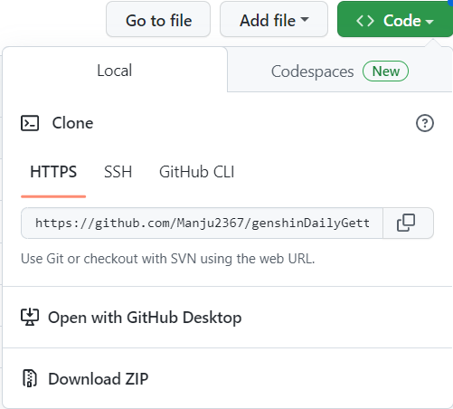
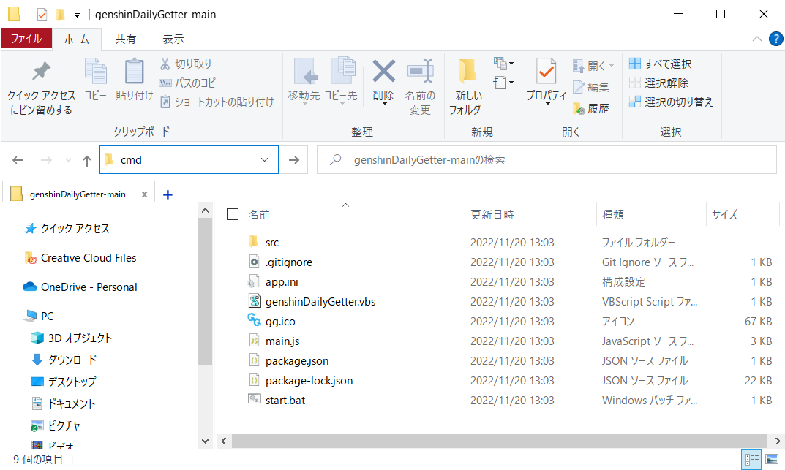
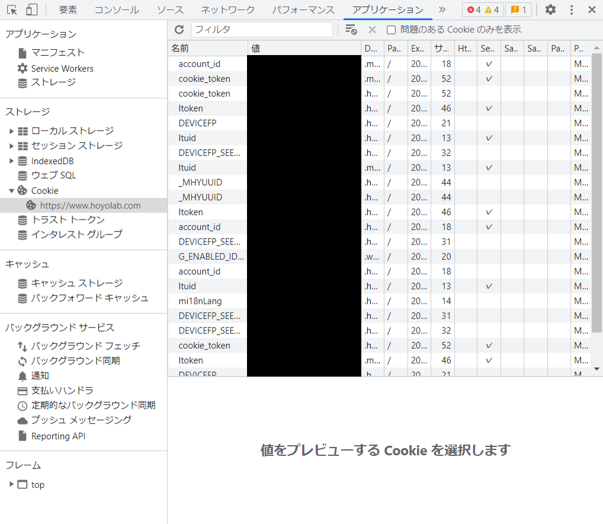

# Genshin Daily Getter

## 使い方

1. プロジェクトをダウンロードする。<br>
   Code -> Download ZIP からプロジェクトのzipファイルをダウンロードする。<br>
   ダウンロードした後、適当な場所(Cドライブ等)に展開する。<br><br>
   <br><br>
2. Node.js をインストールする。<br>
   既にインストールされている場合は必要ない。<br>
   インストーラーから特にオプションはチェックせずにインストールする。<br>
   [Node.js](https://nodejs.org/ja/)(LTS 推奨版をダウンロード)<br><br>
   ※インストールできたかどうかの確認
   ```
   node --version
   ```
   ```
   npm --version
   ```
   <br>
3. 必要なパッケージをインストールする。<br>
   先程展開したプロジェクトフォルダをエクスプローラーで開き、アドレスバーに cmd と打ってコマンドプロンプトを起動する。<br><br>
   <br><br>
   以下のコマンドを打ち、必要なパッケージをインストールする。
   ```
   npm install
   ```
   <br>
4. app.ini にユーザー情報を入力する。<br>
   app_default.iniをapp.iniに名前変更する。<br>
   [HoYoLAB](https://www.hoyolab.com/home)にアクセスし、ログインしておく。<br>
   HoYoLAB を開いたブラウザで **F12**、もしくは **Ctrl + Shift + i** を入力して開発者ツールを開く（デフォルトは英語表記）。<br>
   アプリケーションタブから Cookie -> https\://www.hoyolab.com を開き、**ltuid** と **ltoken** の値をapp.iniファイルの **LTUID** と**LTOKEN** にそれぞれコピペする。<br><br>
   <br><br>
5. 起動してみる。<br>
   GenshinDailyGetter.vbsを起動する。<br>
   <u>**この時、「次回から確認しない」のようなチェックボックスが出てくるのでチェックを入れておく。**</u><br>
   既にデイリー報酬を受け取っていた場合、「今日のデイリー報酬は受け取り済みです。」という通知が届く。そうでない場合、「デイリー報酬を受け取りました。」というメッセージと、受け取った報酬の内容の通知が届く。<br><br>
6. PC起動時に受け取るようにする。<br>
   genshinDailyGetter.vbsのショートカットを作成する。<br>
   エクスプローラーを開き、アドレスバーに「shell:startup」と入力すると、スタートアップのフォルダが開く。<br>
   そこに作成したショートカットを移動する。<br><br>

## exeバージョン
[こちら](https://github.com/Manju2367/genshinDailyGetter/tree/electron)のREADME.mdをご覧ください。

## バグ報告

[こちら](https://github.com/Manju2367/genshinDailyGetter/issues)にお願いします。
